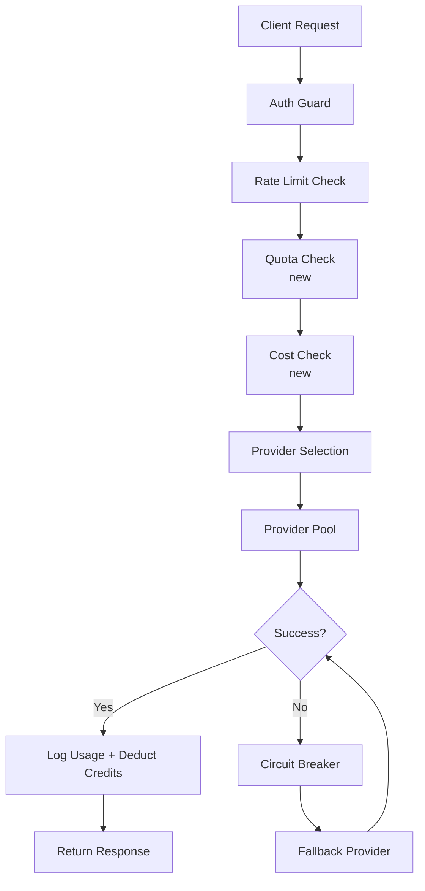

# Phase 9 — Monetization, Trial, Quota & AI Gateway Plan

> **Status:** Phase 9G complete — Admin Payment Dashboard, Support Flow, Production Launch Checklist
> **Last updated:** June 20, 2026

---

## Table of Contents

1. [Audit Findings](#1-audit-findings)
2. [Business Rules Proposal](#2-business-rules-proposal)
3. [AI Credit Cost Model](#3-ai-credit-cost-model)
4. [Technical Architecture Proposal](#4-technical-architecture-proposal)
5. [Implementation Phases](#5-implementation-phases)
6. [Risk Assessment](#6-risk-assessment)
7. [Files Likely to Change](#7-files-likely-to-change)
8. [What Must Not Be Changed Yet](#8-what-must-not-be-changed-yet)

---

## 1. Audit Findings

### 1.1 Auth System

| Aspect | Finding |
|--------|---------|
| **Supabase helpers** | `lib/supabase/server.ts` — `getUser()`, `requireAuth()`, `requireRole()`. `getUser()` is `cache()`-wrapped, returns Prisma `User` with all fields (role, isPremium, etc.). |
| **Role model** | Enum `Role` with 3 values: `GURU`, `MURID`, `ADMIN`. Stored as field `role` on `User` model directly. |
| **Where role is stored** | `User.role` (Prisma field, not Supabase metadata). Supabase JWT `user_metadata.role` is set during registration but the authoritative source is Prisma. |
| **Route protection pattern** | Middleware (`middleware.ts`): public paths skip auth, `selfAuthPaths` (`/api/`, `/arena/`, `/guru/`, `/admin/`) handle auth internally. Middleware only blocks unauthenticated users — no role-based redirect. Role routing happens in callback route (`/api/auth/callback`) and login action. |
| **User creation points** | 5 locations: Google OAuth callback, email register action, email register API, `/api/user/me` upsert, `/api/user/simple-upsert`. Each defaults GURU or infers from Supabase metadata. |
| **`getUserPlan()`** | Returns `"PRO"` if `isFounder || (isPremium && premiumUntil > now)`, else `"FREE"`. |

### 1.2 User Model — Premium-Related Fields

```prisma
model User {
  id                 String       @id @default(cuid())
  supabaseId         String       @unique
  email              String       @unique
  fullName           String
  avatar             String?
  emailConfirmed     Boolean      @default(false)
  onboarded          Boolean      @default(false)
  role               Role         @default(MURID)
  isFounder          Boolean      @default(false)
  premiumPlan        PremiumPlan  @default(FREE)     // enum: FREE | PRO
  premiumUntil       DateTime?
  isPremium          Boolean      @default(false)
  midtransCustomerId String?
  // Game/social fields: xp, level, streak, coins, etc.
  // Relations: 25+ related models
  createdAt          DateTime     @default(now())
  updatedAt          DateTime     @updatedAt
}
```

| Field | Type | Default | Notes |
|-------|------|---------|-------|
| `premiumPlan` | `PremiumPlan` enum | `FREE` | Only `FREE` / `PRO` — no mid-tier |
| `premiumUntil` | `DateTime?` | null | When PRO expires |
| `isPremium` | `Boolean` | `false` | Redundant with premiumPlan/premiumUntil |
| `midtransCustomerId` | `String?` | null | Never populated |
| `isFounder` | `Boolean` | `false` | Bypasses all restrictions |

**No fields exist for:** trial, credits, quota, subscription, school/institution.

### 1.3 Existing Premium / Payment Code

| Area | Status |
|------|--------|
| **Midtrans integration** | Live (production). `lib/midtrans.ts` with 2 functions: `createTransaction()` (premium) and `createKaryaTransaction()` (marketplace). |
| **Premium pricing** | Hardcoded: Monthly Rp 49.000, Yearly Rp 399.000. No DB pricing table. |
| **Payment flow** | Snap popup → webhook → update User (`isPremium=true`, `premiumPlan=PRO`, `premiumUntil=now+30/365`). **One-time payment only** — no recurring/subscription. |
| **Webhook** | Handles `settlement`/`capture` for `PREMIUM_UPGRADE` and `KARYA_PURCHASE`. Does NOT handle `deny`/`cancel`/`expire`. |
| **Premium expiry** | No cron job to expire premiums. `premiumUntil` is checked at runtime by `getUserPlan()`. |
| **Landing page** | Mentions "Coba 14 Hari Gratis" — but no trial logic exists anywhere. |
| **Admin controls** | Can toggle `isPremium` per user, list premium users. |
| **Pricing table** | `components/landing/PricingTable.tsx` — 3 tiers: Gratis, Premium Tahunan, Premium Bulanan. |

### 1.4 AI Usage / Rate-Limit System

| Component | Location | Notes |
|-----------|----------|-------|
| **AIUsage model** | `prisma/schema.prisma:1002` | Fields: userId, feature, provider?, model?, status?, errorCode?, tokens, costUSD, latencyMs?, bulan, createdAt. |
| **AiSavedResult model** | `prisma/schema.prisma:619` | Fields: userId, agentId, title, inputJson, outputJson, editableText?, qualityScore?, provider?, model?, metadata?, createdAt, updatedAt. |
| **`usage-logger.ts`** | `src/ai/core/usage-logger.ts` | Exports: `logUsage()`, `logExportEvent()`, `logLegacyUsage()`, `getUserUsage()`. All fire-and-forget. |
| **`agent-runner.ts`** | `src/ai/core/agent-runner.ts` | No quota/premium checks. Pure execution. Checked by API route layer. |
| **`agent-stream-runner.ts`** | `src/ai/core/agent-stream-runner.ts` | No quota/premium checks. Pure execution. |
| **`rate-limit.ts`** | `src/ai/core/rate-limit.ts` | Upstash Redis. Per-agent limits. Premium = 2x base. |
| **`lib/premium.ts`** | `lib/premium.ts` | `checkAIQuota()` — only called by legacy routes (eyd, feedback, grading, text-analysis, rpp, soal). NOT called by central runner. `canUseAI()` always returns `true` (dead code). |
| **Central runner routes** | `app/api/ai/agents/run/route.ts`, `app/api/ai/agents/stream/route.ts` | Check auth + rate limit only. **No quota check**. No premium gating. |
| **Legacy routes** | `app/api/ai/eyd`, `feedback`, `grading`, `text-analysis`, `rpp`, `soal` | Have hardcoded monthly quota check via `checkAIQuota()`. |
| **Export routes** | `app/api/ai/agents/export/*` | No quota check. No premium check. Only auth check. |
| **Admin analytics** | `app/api/admin/ai-analytics/route.ts` | Founder-only. Comprehensive: per-agent, per-provider, daily usage, top users, errors. |

### 1.5 Rate Limit System Weaknesses

| Weakness | Detail |
|----------|--------|
| **Redis dependency** | All rate limiting depends on Upstash Redis. If Redis is down, rate limiting fails open (fallback allows request). |
| **Per-minute only** | No daily or monthly rate limits at the central runner level. |
| **No cost-aware limiting** | Current limits are request-count-based, not cost-based. An expensive 5-credit RPP costs the same as a 1-credit EYD check. |
| **Legacy routes bypass central limits** | Legacy routes have their own separate quota system (`checkAIQuota()` in `lib/premium.ts`). |
| **No quota for exports** | Export routes have zero quota checks — unlimited DOCX/PDF/PPTX generation. |
| **`canUseAI()` is dead code** | Function always returns `true` regardless of plan. |
| **Two parallel quota/logging paths** | `recordAIUsage()` (legacy) vs `logUsage()` (central) write to same table with different feature naming conventions. |

### 1.6 Dashboard Structure

| Dashboard | Route | Relevant for monetization |
|-----------|-------|---------------------------|
| **Guru Beranda** | `/guru/beranda` | Already shows upgrade CTA if not premium. Safe to add trial badge. |
| **Guru Pengaturan** | `/guru/pengaturan` | Shows premium status with expiry date. Safe to add trial info. |
| **Guru Premium Page** | `/guru/pengaturan/premium` | Current upgrade page with Snap. Will need trial-aware messaging. |
| **Murid Dashboard** | `/arena` | No premium features yet. |
| **Admin Panel** | `/admin` | User management page can toggle premium. AI Analytics exists. Need trial/quota management UI. |

### 1.7 Payment Stack Summary

```
Payment Flows:
┌──────────────────────────────────────────────────────────┐
│ PREMIUM_UPGRADE (one-time, no recurring):                │
│   Guru Premium Page → create-invoice API → Snap popup    │
│   → Webhook → User.isPremium=true, premiumUntil+=30/365  │
│                                                          │
│ KARYA_PURCHASE (marketplace, one-time):                  │
│   Marketplace → purchase API → Snap popup                │
│   → Webhook → Pembelian, SellerEarning, etc.             │
│                                                          │
│ MISSING:                                                 │
│   - Subscription/recurring billing                       │
│   - Trial management                                     │
│   - Cron job for premium expiry                          │
│   - Refund handling                                      │
│   - Customer management (midtransCustomerId never used)  │
└──────────────────────────────────────────────────────────┘
```

---

## 2. Business Rules Proposal

### 2.1 Murid

| Rule | Value | Rationale |
|------|-------|-----------|
| **Free** | Always free | Murid feature restrictions not needed yet. No AI features for Murid currently. |
| **AI features** | None currently | If student AI is added later, limit to 1-2 credits/day. |
| **No hard gating** | No restrictive UI | Keep Murid experience frictionless. |

### 2.2 Guru New User

| Rule | Value | Rationale |
|------|-------|-----------|
| **30-day Pro Trial** | Automatic on first Guru dashboard access | Gives full experience before commitment. |
| **Trial trigger** | First `GET /guru/*` or first AI tool use | Using first dashboard access is safer — doesn't penalize users who register but don't immediately use AI. |
| **Trial AI credits** | 200 total credits for trial period | Enough for ~40 RPP generations or ~200 EYD checks. Prevents abuse. |
| **No payment required** | No credit card needed at signup | Lowers activation friction. |
| **Trial badge** | Visible in Guru sidebar | Shows remaining days so user knows when trial ends. |

### 2.3 Guru Free (after trial)

| Rule | Value | Rationale |
|------|-------|-----------|
| **Dashboard access** | Full | Dashboard is the core product — blocking it would drive users away. |
| **View saved results** | Full | Saved work should never be locked. |
| **AI credits** | 30 credits/month | Enough for ~6 RPPs or ~30 EYD checks per month. Maintains utility while creating upgrade motivation. |
| **Export** | PDF only (1 credit each) | DOCX/PPTX require Pro. PDF is universal and lower cost. |
| **Streaming priority** | Normal | No priority over Pro users. |
| **Saved results limit** | 50 saved results | Keep storage manageable. |
| **Marketplace upload** | 3 free uploads (existing rule) | Already implemented in current code. |

### 2.4 Guru Pro (paid)

| Rule | Value | Rationale |
|------|-------|-----------|
| **AI credits** | 500 credits/month | Covers heavy usage (~100 RPPs or ~500 EYD checks). |
| **Export** | DOCX + PDF + PPTX (included) | Full export suite is a key Pro differentiator. |
| **Saved results** | Unlimited | Power users generate lots of content. |
| **Streaming priority** | High | Better experience for paying users. |
| **Marketplace** | Unlimited uploads (existing) | Already implemented. |
| **Rollover unused credits** | No (use-it-or-lose-it monthly) | Simplifies accounting. |

### 2.5 School / Institution (future)

| Rule | Value | Rationale |
|------|-------|-----------|
| **Pooled quota** | Shared credit pool for N teachers | Administrators buy a block of credits and distribute. |
| **Admin dashboard** | Usage reports per teacher | Visibility for school decision-makers. |
| **Custom branding** | Optional | Enterprise feature. |
| **Pricing** | TBD (per-teacher or per-quota) | Needs market research. |

### 2.6 Founder / Admin

| Rule | Value | Rationale |
|------|-------|-----------|
| **Unlimited** | No quota checks | `isFounder` already bypasses everything. Keep this. |

---

## 3. AI Credit Cost Model

### 3.1 Why Credits > Request Count

| Approach | Problem |
|----------|---------|
| **Request count** | A 1-token EYD check costs ~$0.00002. A 4000-token RPP costs ~$0.08. Same request count, 4000x cost difference. Request counting would either under-price expensive agents or over-price cheap ones. |
| **Token counting** | Accurate but complex. Streaming routes report 0 tokens. Token counts vary by provider. Adds latency. Hard to explain to users. |
| **Credits** | Abstract, predictable, user-friendly. "1 credit = ~$0.001-0.002 actual cost." Simple mental model. Easy to display. Hard to game. |

### 3.2 Proposed Credit Costs

| Agent | Credits | Cost Ratio | Rationale |
|-------|---------|------------|-----------|
| **eyd** (Korektor EYD) | 1 | 1x | Short input, cheap provider call. |
| **bc-assistant** | 1 | 1x | Chat-style, typically short exchanges. |
| **feedback** (Feedback Siswa) | 2 | 2x | Medium-length analysis, some provider cost. |
| **grading** (Penilaian Otomatis) | 2 | 2x | Similar to feedback. |
| **review** (Review Materi) | 2 | 2x | Medium-length review. |
| **text-analysis** | 2-4* | 2-4x | Scales with input text length. |
| **soal** (Buat Soal) | 3 base + 1 per 5 questions over 10 | 3-5x | Question generation is expensive. Scales with output size. |
| **rpp** (RPP/Modul Ajar) | 5 | 5x | Long structured output. Most expensive provider call. |
| **ppt** (Buat PPT) | 5 | 5x | Similar complexity to RPP. |
| **Export DOCX** | 1 | 1x | File generation is cheap. Free for Pro / 1 credit for Free. |
| **Export PDF** | 0 (free for Free), free for Pro | 0 | PDF is universal format. |
| **Export PPTX** | 1 | 1x | Complex format generation. Free for Pro. |

*\*text-analysis: base 2 credits for < 500 words, +1 credit per additional 500 words, max 4 credits.*

### 3.3 Credit Packs per Plan

| Plan | Monthly Credits | Trial Total | Per-Agent Cap | Rollover |
|------|-----------------|-------------|---------------|----------|
| **Trial (30-day)** | N/A (fixed pool) | 200 | No | No |
| **Free** | 30 | N/A | No | No |
| **Pro (monthly)** | 500 | N/A | No | No |
| **Pro (yearly)** | 6000 (500/mo × 12) | N/A | No | No |
| **School** | TBD | N/A | Configurable | Optional |

### 3.4 Cost Leak Prevention

| Measure | How |
|---------|-----|
| **Credit burn limit** | Max 50 credits per single request. Prevents runaway costs from a single agent call. |
| **Daily velocity cap** | Max 100 credits/day for Free, 200 for Pro. Prevents automated abuse. |
| **Provider budget guard** | If total provider spend exceeds daily budget, degrade to cheaper model. |
| **Circuit breaker** | If error rate > 20% in 5 minutes, pause that provider. |
| **Fraud detection** | Flag users consuming >5x typical daily usage. |
| **Multiple account detection** | Future. Check IP/session patterns. |

### 3.5 User Experience Considerations

| Principle | Implementation |
|-----------|---------------|
| **Transparency** | Show credit cost before user clicks "Generate". Show remaining credits in sidebar. |
| **Graceful degradation** | Free users with 0 credits: "You've used all your credits this month. Upgrade to Pro or wait until next month." |
| **Warning at 20%** | Show subtle warning when credits are running low. |
| **No surprise billing** | Never auto-purchase more credits. User must explicitly upgrade. |
| **Trial end countdown** | Show remaining trial days prominently in last 7 days. |

---

## 4. Technical Architecture Proposal

### 4.1 Plan Policy

```typescript
type Plan = "FREE" | "PRO_TRIAL" | "PRO" | "SCHOOL";
```

| Plan | Determination |
|------|--------------|
| `FREE` | Default. No active premium, no active trial. |
| `PRO_TRIAL` | User is GURU, `trialStartedAt` is set, `trialEndsAt > now`. |
| `PRO` | `isPremium && premiumUntil > now && !isFounder`. |
| `SCHOOL` | (Future) User belongs to a School with pooled quota. |

Priority order for resolution:
1. `isFounder` → unlimited (no plan check needed)
2. `PRO` → use Pro quota
3. `PRO_TRIAL` → use Trial quota
4. `FREE` → use Free quota

### 4.2 Quota Policy

```typescript
interface QuotaConfig {
  monthlyCredits: number;     // credits renewed each bulan
  maxPerRequest: number;      // max credits a single request can cost
  dailyVelocityCap: number;   // max credits per day
  savedResultLimit: number;   // max saved results (-1 = unlimited)
  exportAllowed: string[];    // allowed export formats
}
```

| Plan | monthlyCredits | maxPerRequest | dailyVelocityCap | savedResultLimit | exportAllowed |
|------|---------------|---------------|------------------|------------------|---------------|
| FREE | 30 | 10 | 20 | 50 | ["pdf"] |
| PRO_TRIAL | 200 (total) | 50 | 100 | 200 | ["docx", "pdf", "pptx"] |
| PRO | 500 | 50 | 200 | -1 | ["docx", "pdf", "pptx"] |

Quota resets on the 1st of each month (`bulan` field). Trial quota is a fixed pool consumed over 30 days.

### 4.3 AI Gateway Architecture



#### 4.3.1 Gate Layers

| Layer | Responsibility | File | Existing? |
|-------|---------------|------|-----------|
| **1. Auth Guard** | Verify user is authenticated | `lib/supabase/server.ts` → `getUser()` | ✅ Yes |
| **2. Plan Resolver** | Determine user's plan: FREE / PRO_TRIAL / PRO / SCHOOL | New: `lib/ai-gateway/plan-resolver.ts` | ❌ New |
| **3. Quota Checker** | Read remaining credits, compare to request cost | New: `lib/ai-gateway/quota-checker.ts` | ❌ New |
| **4. Cost Policy** | Map agentId + input → credit cost | New: `lib/ai-gateway/cost-policy.ts` | ❌ New |
| **5. Rate Limit** | Per-minute request throttle | Existing: `src/ai/core/rate-limit.ts` | ✅ Yes |
| **6. Provider Budget Guard** | Check daily provider spend | New: `lib/ai-gateway/provider-guard.ts` | ❌ New |
| **7. Circuit Breaker** | Skip failing providers | New: `lib/ai-gateway/circuit-breaker.ts` | ❌ New |
| **8. Usage Logger** | Log to AIUsage, deduct credits | Existing: `src/ai/core/usage-logger.ts` | ✅ Partial |

#### 4.3.2 Provider Pool & Fallback Order

| Rank | Provider | Model | Cost Tier | When to Use |
|------|----------|-------|-----------|-------------|
| 1 | DeepSeek | deepseek-chat | Low | Primary for all agents (cheapest) |
| 2 | Groq | llama-3.3-70b-versatile | Low | Fallback if DeepSeek fails |
| 3 | Gemini | gemini-2.0-flash-001 | Medium | Last resort |

If budget guard is active (daily provider spend exceeded):
- Degrade all non-critical agents (eyd, bc-assistant, feedback) to only DeepSeek
- Block expensive agents (rpp, ppt, soal) with "Budget cap reached. Try again tomorrow."

#### 4.3.3 Request Classifier

New module that classifies every AI request:

```typescript
interface ClassifiedRequest {
  agentId: string;
  estimatedCost: number;       // in credits
  providerTier: "low" | "medium" | "high";
  priority: "normal" | "high"; // Pro users get high priority
  estimatedTokens: number;
  requiresExport: boolean;
}
```

### 4.4 Data Model Recommendation

#### Option A: Minimal (add fields to User)

Minimal schema changes — add trial fields to User model:

```prisma
model User {
  // ... existing fields
  trialStartedAt  DateTime?
  trialEndsAt     DateTime?
  // No new models
}
```

Quota tracked via existing `AIUsage` table by querying `SUM(costUSD)` per `bulan` per `userId`.

**Pros:** 0 new models, minimal migration risk, leverages existing data.
**Cons:** Querying credit balance requires aggregation queries (slower at scale). No audit trail for credit changes. Harder to debug.

#### Option B: Credit Ledger (recommended)

Add trial fields to User + new `AiCreditLedger` model:

```prisma
model User {
  // ... existing fields
  trialStartedAt  DateTime?
  trialEndsAt     DateTime?
}

model AiCreditLedger {
  id        String   @id @default(cuid())
  userId    String
  plan      String   // "FREE" | "PRO_TRIAL" | "PRO"
  bulan     String   // "YYYY-MM"
  creditsUsed Int    @default(0)
  creditsTotal Int   // total allocated for this period
  createdAt DateTime @default(now())
  updatedAt DateTime @updatedAt

  user User @relation(fields: [userId], references: [id], onDelete: Cascade)
  @@unique([userId, plan, bulan])
  @@index([userId, bulan])
}
```

**Pros:** Fast lookups. Clear audit trail. Easy admin debugging. Supports pre-allocating credits.
**Cons:** 1 new model. Need to seed records on plan change / month rollover.

#### Option C: Full Subscription Model (future)

All of Option B + new `SubscriptionPlan` model + `School` model:

```prisma
model SubscriptionPlan {
  id          String   @id @default(cuid())
  name        String   // "Guru Pro Monthly", "Guru Pro Yearly", "School"
  price       Int      // in IDR
  creditsPerMonth Int
  durationDays Int
  features    Json     // feature flags
  isActive    Boolean  @default(true)
  createdAt   DateTime @default(now())
}

model School {
  id        String   @id @default(cuid())
  name      String
  email     String?
  quotaPool Int      @default(5000)
  createdAt DateTime @default(now())
}

model User {
  // ... existing fields
  subscriptionPlanId String?
  schoolId          String?
  trialStartedAt    DateTime?
  trialEndsAt       DateTime?
}
```

**Recommendation: Start with Option B (Credit Ledger).** Option C can be added in Phase 9F when subscription/payment is implemented. Option A is too minimal — fast queries matter for real-time quota checks.

### 4.5 Admin Controls (Phase 9E)

| Feature | Implementation |
|---------|---------------|
| **View trial users** | List `User` where `trialEndsAt > now` |
| **Extend trial** | PATCH `User.trialEndsAt` |
| **View credit usage** | Query `AiCreditLedger` aggregated per user |
| **See high-cost users** | Sort by `creditsUsed` in current `bulan` |
| **Manual quota reset** | Delete/reset `AiCreditLedger` records |

---

## 5. Implementation Phases

### Phase 9B — ✅ COMPLETE (June 20, 2026)

**Goal:** AI Gateway + Credit Ledger foundation in soft mode. No blocking, no monetization UI.

**Schema changes:**
- Added to `User` model: `trialStartedAt DateTime?`, `trialEndsAt DateTime?`, `trialPlan String?`, `trialCreditsTotal Int?`
- Created `AiCreditLedger` model with fields: `id`, `userId`, `period`, `plan`, `creditsTotal`, `creditsUsed`, `creditsReserved`, `source`, `startsAt`, `endsAt`, `createdAt`, `updatedAt`
- Relation: `User.aiCreditLedger → AiCreditLedger[]`
- Applied via `prisma db push` (non-destructive)

**AI Gateway files created in `lib/ai-gateway/`:**
- `gateway-types.ts` — TypeScript types for all gateway modules
- `agent-cost-policy.ts` — `calculateAgentCost(agentId, input)` maps each agent to credit cost (eyd=1, rpp=5, etc.)
- `plan-resolver.ts` — `resolveUserAiPlan(user)` returns plan (FOUNDER/MURID_FREE/GURU_PRO/GURU_PRO_TRIAL/GURU_FREE)
- `quota-policy.ts` — per-plan quota limits (credits per month, max per request, daily cap, saved result limit)
- `quota-checker.ts` — `checkQuota()`, `getOrCreateCreditLedger()`, `getCreditUsage()`, `getRemainingCredits()`. All soft-mode (never blocks).
- `provider-guard.ts` — In-memory provider health tracking, failure threshold (5 failures in 2 min → 5 min cooldown)
- `circuit-breaker.ts` — Re-exports from provider-guard with `getCircuitBreakerState()`
- `index.ts` — Barrel exports

**Soft integration into central routes:**
- `POST /api/ai/agents/run` — quota check before execution, `_quota` metadata attached to response
- `POST /api/ai/agents/stream` — quota check before stream starts, `quota` event sent as first SSE event

**Admin analytics update:**
- Estimated credit usage added to system notes (based on successful agent runs × agent cost)
- Top 3 most-used agents displayed

**Limitations:**
- No hard blocking (Phase 9D)
- No trial auto-start (Phase 9C)
- No credit deduction (Phase 9D)
- In-memory provider health (resets on cold start)
- No legacy route integration yet (Phase 9D)
- Credit estimates are rough (use base costs, not variable costs)

### Phase 9C — ✅ COMPLETE (June 20, 2026)

**Goal:** Auto-start 30-day Guru Pro Trial for eligible users + trial/credit UI in soft mode.

**Trial auto-start:**
- Triggered on first Guru dashboard access (`guru/layout.tsx` server component)
- Eligible: Guru role, not Founder/Admin, not premium, no existing trial
- Sets `trialStartedAt=now`, `trialEndsAt=now+30d`, `trialPlan=GURU_PRO_TRIAL`, `trialCreditsTotal=200`
- Creates `AiCreditLedger` record with `period="trial"`, `creditsTotal=200`
- Idempotent: does not overwrite existing trial or premium

**Trial service (`lib/ai-gateway/trial-service.ts`):**
- `shouldStartGuruTrial(user)` — check eligibility
- `startGuruTrialIfEligible(userId)` — atomic transaction to update user + create ledger
- `getTrialStatus(user)` — returns `isTrialActive`, `daysRemaining`, `trialEndsAt`, `trialPlan`

**Sidebar badge (`components/guru/SidebarPremiumBadge.tsx`):**
- Shows in sidebar under user profile in Guru layout
- Trial: violet badge with Sparkles icon, remaining days + credits
- Premium: emerald badge with Crown icon, expiry date
- Free: gray badge with Zap icon, remaining credits
- Founder: amber badge with Crown icon

**Beranda card (`components/guru/TrialStatusCard.tsx`):**
- Shows between greeting and stats grid on Guru beranda
- Active trial: violet gradient card with days remaining, credit count, CTA to AI tools
- Active premium: emerald gradient card
- Free after trial: subtle gray card with "Fitur dasar tetap bisa digunakan"

**AI tools credit balance (`components/guru/AiCreditBalance.tsx`):**
- Shows above agent selector in AI tools sidebar
- Compact one-line display: plan icon + name + credit balance
- Trial: "Guru Pro Trial • 187/200 credit tersisa • 24 hari lagi"
- Free: "Guru Free • 30 credit/bulan"
- Pro: "Guru Pro • 500 credit/bulan"

**Quota status API (`GET /api/ai/quota/status`):**
- Returns: `{ plan, unlimited, creditsTotal, remainingCredits, period, isTrial, trialEndsAt, daysRemaining }`
- Auth required, user can only access own status
- No sensitive data

**Admin analytics update:**
- Added to system notes: active trial count + trials expiring in 7 days

**Edge cases handled:**
- Existing premium → no trial
- Expired premium + no trial → eligible
- Existing expired trial → no restart
- New Murid → no trial
- Admin/Founder → no trial
- Role change Murid→Guru → eligible on first Guru dashboard access
- Missing trialEndsAt → safe handling, no overwrite

**Limitations:**
- No hard blocking (Phase 9D)
- No credit deduction (Phase 9D)
- No legacy route integration (Phase 9D)
- No upgrade/payment flow yet (Phase 9F)

### Phase 9B — ✅ COMPLETE — AI Gateway + Credit Ledger Foundation

**Goal:** Build the credit infrastructure without changing user-facing behavior.

**Scope:**
- [x] Create `lib/ai-gateway/` with 7 modules
- [x] Add trial fields + AiCreditLedger to Prisma schema
- [x] Write trial/service ledger functions
- [x] Soft integration into central AI routes
- [x] Admin analytics credit estimates
- [x] 42/42 tests pass

### Phase 9C — ✅ COMPLETE — Trial Auto-Start + UI Badges

**Goal:** Trial auto-starts for new Guru users. All users can still use AI (soft mode).

**Scope:**
- [x] Auto-start trial in `guru/layout.tsx` (server component, first dashboard access)
- [x] Trial service: `lib/ai-gateway/trial-service.ts`
- [x] Sidebar badge: `components/guru/SidebarPremiumBadge.tsx`
- [x] Beranda trial card: `components/guru/TrialStatusCard.tsx`
- [x] AI tools credit balance: `components/guru/AiCreditBalance.tsx`
- [x] Quota status API: `GET /api/ai/quota/status`
- [x] Admin analytics trial notes
- [x] Soft mode: no blocking, no deduction, no payment

**Files created:**
- `lib/ai-gateway/trial-service.ts`
- `components/guru/SidebarPremiumBadge.tsx`
- `components/guru/TrialStatusCard.tsx`
- `components/guru/AiCreditBalance.tsx`
- `app/api/ai/quota/status/route.ts`

**Files modified:**
- `app/(dashboard)/guru/layout.tsx` — auto-start trial + sidebar badge
- `app/(dashboard)/guru/beranda/page.tsx` — add TrialStatusCard
- `app/(dashboard)/guru/ai-tools/_components/alat-ai-client.tsx` — add AiCreditBalance
- `app/api/admin/ai-analytics/route.ts` — trial notes

### Phase 9D — Hard Gating ✅ (Complete: June 20, 2026)

**Goal:** Block AI requests when credits are exhausted. User sees friendly quota messages.

**What was implemented:**

1. **Hard mode config** (`lib/ai-gateway/gateway-config.ts`):
   - `isHardMode()` returns `true` in production, `false` in development
   - Override via env `AI_CREDIT_HARD_MODE=true|false`
   - Rollback: set `AI_CREDIT_HARD_MODE=false`

2. **Atomic credit deduction** (`lib/ai-gateway/quota-checker.ts`):
   - `deductCreditsAtomic()` uses `$executeRawUnsafe` with conditional SQL:
     ```sql
     UPDATE "AiCreditLedger" SET "creditsUsed" = "creditsUsed" + $1
     WHERE id = $2 AND "creditsUsed" + $1 <= "creditsTotal" AND $1 > 0
     ```
   - Returns `{ deducted: true }` on success, `{ deducted: false, reason }` on failure
   - Founder/Admin/Murid bypass deduction
   - Never deduct on failed generation (deduction only after successful provider response)
   - Never double-deduct streaming (deduction only after `final_result` event)
   - No separate reservation table needed

3. **Monthly ledger creation** (`ensureMonthlyLedger()`):
   - Ensures ledger exists before quota checks
   - Period format: `YYYY-MM` for monthly, `"trial"` for trial
   - Uses `upsert` to avoid duplicates

4. **Central run route gating** (`POST /api/ai/agents/run`):
   - Calls `checkAndPrepareDeduction()` before execution
   - If blocked: returns 402 with `{ error: "QUOTA_EXCEEDED", message, quota: {...} }`
   - Deducts credits only after `result.success === true`
   - Attaches updated quota metadata (`_quota`) to response

5. **Stream route gating** (`POST /api/ai/agents/stream`):
   - Checks quota before starting SSE stream
   - If blocked: sends `quota_error` SSE event + `[DONE]`, no provider execution
   - If allowed: sends `quota` event, executes stream
   - Deducts only after `final_result` event is received
   - Never deducts on abort/error/incomplete stream

6. **Export route quota** (DOCX, PDF, PPTX):
   - DOCX: checks quota, deducts 1 credit after successful generation
   - PPTX: checks quota, deducts 1 credit after successful generation
   - PDF: 0 credits (free) — always allowed, checks pass through

7. **Legacy route migration** (4 routes):
   - `/api/ai/eyd` — gateway quota check + deduction after success
   - `/api/ai/feedback` — gateway quota check + deduction after success
   - `/api/ai/grading` — gateway quota check + deduction after success
   - `/api/ai/text-analysis` — gateway quota check + deduction after success
   - All preserve old response shapes; old `checkAIQuota()` kept for backward compatibility

8. **Quota status API update**:
   - Added: `hardMode`, `resetAt`, `creditsUsed`, `canGenerateLight`, `canGenerateMedium`, `canGenerateHeavy`

9. **Client quota error UX**:
   - `QuotaExceededError` class with quota info payload
   - `isQuotaError()` type guard
   - Amber quota error banner with plan info, remaining credits, reset date
   - Streaming: handles `quota_error` SSE event
   - Button to dismiss banner
   - No crash, no stack trace

10. **Admin analytics update**:
    - Hard mode status note
    - Total credits used this month
    - Users with 0 credits remaining (raw SQL query)
    - Top credit consumers (top 3)

11. **StreamEvent type updated**: Added `quota_error` variant

**Files created:**
- `lib/ai-gateway/gateway-config.ts`

**Files modified:**
- `lib/ai-gateway/quota-checker.ts` — hard mode, atomic deduction, export quota, ledger info
- `lib/ai-gateway/index.ts` — added exports
- `app/api/ai/agents/run/route.ts` — hard gating + deduction
- `app/api/ai/agents/stream/route.ts` — hard gating + deduction + quota_error event
- `app/api/ai/agents/export/docx/route.ts` — quota check + deduction
- `app/api/ai/agents/export/pdf/route.ts` — quota check (free)
- `app/api/ai/agents/export/pptx/route.ts` — quota check + deduction
- `app/api/ai/eyd/route.ts` — gateway migration
- `app/api/ai/feedback/route.ts` — gateway migration
- `app/api/ai/grading/route.ts` — gateway migration
- `app/api/ai/text-analysis/route.ts` — gateway migration
- `app/api/ai/quota/status/route.ts` — expanded fields
- `app/api/admin/ai-analytics/route.ts` — Phase 9D system notes
- `src/ai/core/agent-stream-runner.ts` — added `quota_error` StreamEvent variant
- `app/(dashboard)/guru/ai-tools/lib/agent-api.ts` — QuotaExceededError, quota_error SSE handling
- `app/(dashboard)/guru/ai-tools/_components/alat-ai-client.tsx` — quota error UI banner
- `docs/AI_MONETIZATION_AND_GATEWAY_PLAN.md` — Phase 9D completed status

**Rollback:** Set `AI_CREDIT_HARD_MODE=false` in environment to return to soft mode (no blocking, no deduction).

**Known limitations:**
1. No grace requests (0 credits → still block immediately; Phase 9E or later)
2. Legacy routes still call `recordAIUsage()` independently (dual logging)
3. No admin quota management UI (Phase 9E)
4. No payment/subscription integration (Phase 9F)
5. Export events in AIUsage lack credit deduction info
6. Circuit breaker not yet integrated with quota checks

### Phase 9E — Admin Trial/Quota Dashboard

**Goal:** Admin can monitor and manage trials and quota usage.

**Scope:**
- [ ] New admin page: `/admin/ai-quota` — table of all users with credit usage
- [ ] Filter: trial users, high-usage users, blocked users
- [ ] Action: extend trial (add N days)
- [ ] Action: reset monthly credits
- [ ] Action: manually allocate credits
- [ ] Export to CSV

**Files to create:**
- `app/(dashboard)/admin/ai-quota/page.tsx`

**Files to modify:**
- `app/api/admin/ai-quota/route.ts` — API for quota management
- `components/admin/AdminSidebar.tsx` — add "AI Quota" nav item

### Phase 9F — Payment/Subscription Integration (future)

**Not yet planned.** Will include Midtrans subscription API integration, auto-renewal webhook handling, pricing page updates, and subscription management UI.

---

## 6. Risk Assessment

| # | Risk | Likelihood | Impact | Mitigation |
|---|------|-----------|--------|------------|
| 1 | **Existing users without trial fields** | High | Medium | Add migration to backfill trial fields for all existing GURU users. Set `trialEndsAt = createdAt + 30 days` for users created in last 30 days. For older users, set `trialEndsAt = now` (no trial). |
| 2 | **Role confusion (Guru/Murid/Admin)** | Low | Low | Role is stored and checked consistently. Admin is separate. Murid get no trial. Only GURU role triggers trial. |
| 3 | **Users switching roles** | Low | Medium | A user who switches from MURID → GURU should get trial from switch date. Track `roleChangedAt` or simply check if `trialStartedAt` is null. |
| 4 | **Old standalone AI routes bypassing quota** | High | High | All 6 legacy routes must be updated to call the new gateway's `quotaCheck()`. If any route is missed, cost leaks. Phase 9D must explicitly cover all 6 legacy routes. |
| 5 | **Streaming routes bypassing quota** | Medium | High | Streaming executes before quota check completes (async). Must check quota SYNCHRONOUSLY before starting the stream. |
| 6 | **Export routes bypassing quota** | High | Medium | Exports currently have zero checks. Must add quota gateway to all 3 export routes. |
| 7 | **Data migration risks** | Medium | Medium | Adding `trialStartedAt`/`trialEndsAt` to User is non-destructive. Adding `AiCreditLedger` is a new table. Both are safe with `prisma db push`. No data loss risk. |
| 8 | **Cost leakage from abuse** | High | High | Multiple accounts, automated scripts. Mitigations: daily velocity cap, fraud detection flags, rate limiting already in place. |
| 9 | **API key/provider limits** | Medium | High | DeepSeek/Groq/Gemini have rate limits and quota. Circuit breaker + provider guard must be implemented before Phase 9D to avoid hard gating users when provider limits are hit (not user credits). |
| 10 | **Premium users who paid under old system** | Medium | High | Existing `isPremium=true` users must be grandfathered. `getUserPlan()` already handles this: if `isPremium && premiumUntil > now`, treat as PRO. No change needed. |
| 11 | **Trial users who already paid** | Medium | Low | Should not happen (trial is for new users only). If a user has `isPremium=true`, they skip trial entirely — handled by plan resolver priority. |
| 12 | **Race conditions on credit deduction** | Low | Medium | Two concurrent requests could both read "5 credits remaining" and both pass. Mitigation: use Prisma transaction with atomic decrement or database-level optimistic locking. |
| 13 | **Redis dependency increase** | Low | Low | Rate limiting already depends on Redis. Adding credit checks on DB (PostgreSQL) reduces Redis dependency rather than increasing it. |
| 14 | **User experience degradation** | Medium | High | If gating is too aggressive, users will leave. Must: (a) show costs upfront, (b) provide grace requests at 0 credits, (c) never hide saved results. |

### 6.1 Critical Precondition for Phase 9D

Before hard gating can be enabled:

1. ✅ Rate limiting must work (already does).
2. ❌ Provider circuit breaker must exist (prevents false "out of credits" when provider fails).
3. ❌ `initTrial()` must correctly backfill existing users.
4. ❌ Grace mode must be implemented (3 requests beyond 0 credits).
5. ❌ All 9 central runner routes + 3 export routes + 6 legacy routes must call `quotaCheck()`.
6. ✅ `isFounder` must bypass (already does via `getUserPlan()`).

---

## 7. Files Likely to Change

### Phase 9B

| File | Change |
|------|--------|
| `lib/ai-gateway/cost-policy.ts` | **CREATE** — agent → credit cost mapping |
| `lib/ai-gateway/plan-resolver.ts` | **CREATE** — plan detection + trial logic |
| `lib/ai-gateway/quota-checker.ts` | **CREATE** — canSpendCredits, getRemainingCredits |
| `lib/ai-gateway/provider-guard.ts` | **CREATE** — daily provider spend tracking |
| `lib/ai-gateway/circuit-breaker.ts` | **CREATE** — provider health + skip logic |
| `lib/ai-gateway/index.ts` | **CREATE** — barrel exports |
| `prisma/schema.prisma` | **MODIFY** — add trial fields + AiCreditLedger |
| `src/ai/core/usage-logger.ts` | **MODIFY** — integrate logUsage with ledger |
| `lib/premium.ts` | **MODIFY** — consolidate, remove dead code (canUseAI) |

### Phase 9C

| File | Change |
|------|--------|
| `components/guru/TrialBadge.tsx` | **CREATE** — trial days remaining badge |
| `components/guru/CreditBalance.tsx` | **CREATE** — credit counter display |
| `app/(dashboard)/guru/layout.tsx` | **MODIFY** — add trial badge + credit balance to sidebar |
| `app/(dashboard)/guru/beranda/page.tsx` | **MODIFY** — add credit info widget |
| `app/api/ai/agents/*/route.ts` | **MODIFY** — add soft quota logging |

### Phase 9D

| File | Change |
|------|--------|
| `app/api/ai/agents/run/route.ts` | **MODIFY** — add hard quota guard |
| `app/api/ai/agents/stream/route.ts` | **MODIFY** — add hard quota guard |
| `app/api/ai/agents/export/docx/route.ts` | **MODIFY** — add quota guard |
| `app/api/ai/agents/export/pdf/route.ts` | **MODIFY** — add quota guard |
| `app/api/ai/agents/export/pptx/route.ts` | **MODIFY** — add quota guard |
| `app/api/ai/eyd/route.ts` | **MODIFY** — migrate to new gateway |
| `app/api/ai/feedback/route.ts` | **MODIFY** — migrate to new gateway |
| `app/api/ai/grading/route.ts` | **MODIFY** — migrate to new gateway |
| `app/api/ai/text-analysis/route.ts` | **MODIFY** — migrate to new gateway |
| `app/api/ai/rpp/route.ts` | **MODIFY** — migrate to new gateway |
| `app/api/ai/soal/route.ts` | **MODIFY** — migrate to new gateway |

### Phase 9E

| File | Change |
|------|--------|
| `app/(dashboard)/admin/ai-quota/page.tsx` | **CREATE** — admin quota dashboard |
| `app/api/admin/ai-quota/route.ts` | **CREATE** — quota management API |
| `app/api/admin/ai-quota/extend-trial/route.ts` | **CREATE** — extend trial endpoint |
| `components/admin/AdminSidebar.tsx` | **MODIFY** — add "AI Quota" nav item |

---

## 8. What Must Not Be Changed Yet

| Item | Reason |
|------|--------|
| **Midtrans subscription/recurring billing** | Phase 9F — not needed until payment model is finalized. |
| **Existing pricing on landing page** | Can update after Phase 9D when gating is live — avoid promising features that aren't gated yet. |
| **Middleware (`middleware.ts`)** | Fragile — role routing, CSP, and rate limiting depend on it. Changes here risk breaking auth for all users. |
| **Next.js config (`next.config.ts`)** | Build pipeline dependency. Unnecessary risk. |
| **Murid features** | No monetization planned for Murid. Keep free. |
| **`isFounder` bypass** | Founders must always have unrestricted access. |
| **Viewing saved results** | Never gate access to previously saved work. |
| **Guru dashboard core** | Dashboard is the main product — must remain fully accessible even after trial ends. Only AI tools get gated. |
| **Admin panel** | Must remain accessible regardless of plan. |
| **Payment webhook signature verification** | Security-critical. Do not modify. |
| **Existing `AIUsage` model schema** | Adding `AiCreditLedger` is complementary — don't alter existing `AIUsage` fields. |
| **`recordAIUsage()` legacy logging** | Still called by 6 legacy routes. Keep until those routes are migrated in Phase 9D. |

---

## Appendix A: AI Gateway Flow Diagram

```
                  ┌─────────────┐
                  │  Request    │
                  └──────┬──────┘
                         │
                         ▼
                  ┌─────────────┐
                  │ Auth Guard  │ ← getUser()
                  └──────┬──────┘
                         │ (401 if not authenticated)
                         ▼
                  ┌─────────────┐
                  │ Plan        │ ← plan-resolver.ts
                  │ Resolver    │   (FREE / PRO_TRIAL / PRO)
                  └──────┬──────┘
                         │
                         ▼
                  ┌─────────────┐
                  │ Rate Limit  │ ← rate-limit.ts (Redis)
                  └──────┬──────┘
                         │ (429 if exceeded)
                         ▼
                  ┌─────────────┐
                  │ Cost        │ ← cost-policy.ts
                  │ Calculator  │   (agentId + input → credit cost)
                  └──────┬──────┘
                         │
                         ▼
                  ┌─────────────┐
                  │ Quota       │ ← quota-checker.ts
                  │ Checker     │   (remaining credits >= cost?)
                  └──────┬──────┘
                         │ (402/403 if insufficient)
                         ▼
                  ┌─────────────┐
                  │ Provider    │ ← provider-guard.ts
                  │ Budget Guard│   (daily spend OK?)
                  └──────┬──────┘
                         │ (degrade if over budget)
                         ▼
                  ┌─────────────┐
                  │ Circuit     │ ← circuit-breaker.ts
                  │ Breaker     │   (providers healthy?)
                  └──────┬──────┘
                         │ (skip unhealthy providers)
                         ▼
                  ┌─────────────┐
                  │ Execute     │ ← agent-runner/stream
                  │ Agent       │
                  └──────┬──────┘
                         │
                         ▼
                  ┌─────────────┐
                  │ Log +       │ ← logUsage() + deduct credits
                  │ Deduct      │
                  └──────┬──────┘
                         │
                         ▼
                  ┌─────────────┐
                  │ Return      │
                  │ Response    │
                  └─────────────┘
```

## Appendix B: Credit Ledger Lifecycle

```
User signs up (role=GURU)
  → initTrial()
    → trialStartedAt = now
    → trialEndsAt = now + 30 days
    → AiCreditLedger.create(plan="PRO_TRIAL", bulan=YYYY-MM, creditsTotal=200, creditsUsed=0)

First of next month
  → ensureCreditLedger()
    → if plan == "FREE": AiCreditLedger.upsert(plan="FREE", creditsTotal=30, creditsUsed=0)
    → if plan == "PRO": AiCreditLedger.upsert(plan="PRO", creditsTotal=500, creditsUsed=0)

Trial ends (trialEndsAt < now)
  → plan-resolver returns "FREE"
  → ensureCreditLedger creates FREE ledger with 30 credits

User upgrades to PRO
  → premiumUntil set
  → AiCreditLedger.upsert(plan="PRO", creditsTotal=500, creditsUsed=0)
  → Remaining FREE credits are irrelevant (PRO takes priority)

Credit deduction (every request)
  → AiCreditLedger.update(creditsUsed: {increment: cost})
  → Must use atomic transaction to prevent race condition:
    Prisma.$executeRaw`UPDATE "AiCreditLedger" SET "creditsUsed" = "creditsUsed" + ${cost}
    WHERE "userId" = ${userId} AND "plan" = ${plan} AND "bulan" = ${bulan}
    AND "creditsUsed" + ${cost} <= "creditsTotal"`
```

---

## Phase 9F — Payment Activation (Guru Pro One-Time)

> **Status:** Phase 9F-B complete — Payment QA, Webhook Hardening, Premium Activation Audit, Credit Ledger Sync
> **Last updated:** June 20, 2026

### 9F.1 Checkout Flow

```
/guru/berlangganan
  → POST /api/billing/checkout { planId: "GURU_PRO_MONTHLY" | "GURU_PRO_YEARLY" }
    → Auth guard: must be GURU or ADMIN or Founder
    → Resolve plan from lib/billing/plans.ts (server config, NOT client price)
    → Duplicate pending guard: reject if PENDING transaksi within 5 min
    → Generate orderId: PM-{ts36}-{userId8}
    → Create Transaksi (PENDING) with metadata { planId, durationDays, aiCreditsMonthly }
    → Create Midtrans Snap transaction with server-resolved price
    → Return { transactionId, orderId, token, redirectUrl }
  → Open Snap popup
  → User completes payment
  → Midtrans sends webhook to /api/payment/webhook
  → Webhook verifies SHA512 signature
  → On settlement/capture: activate premium + sync credit ledger
  → Browser redirects to /guru/berlangganan?status=success
```

**Order ID format:** `PM-{base36timestamp}-{first8ofUserId}`  
Example: `PM-ABC123-DEF45678`  
Unique by construction (timestamp to 36-base + userId prefix).

### 9F.2 Webhook Status Handling

| Midtrans Status | Transaksi Status | Premium Activated? | Behavior |
|----------------|-----------------|-------------------|----------|
| `settlement` | SUCCESS | Yes | Activate premium, extend premiumUntil, sync credit ledger |
| `capture` | SUCCESS | Yes | Same as settlement |
| `pending` | PENDING | No | No-op; return 200 to Midtrans |
| `cancel` | CANCELLED | No | Update transaksi status; no premium change |
| `expire` | EXPIRED | No | Update transaksi status; no premium change |
| `deny` | FAILED | No | Update transaksi status; no premium change |
| `failure` | FAILED | No | Update transaksi status; no premium change |
| Unknown | FAILED | No | Fallback; update transaksi status |

### 9F.3 Idempotency Rules

1. **If settlement arrives twice:** Transaksi already `SUCCESS` → skip activation, return `{ ok: true, idempotent: true }`
2. **If pending arrives after success:** Ignore — do not downgrade
3. **If failed/cancel/expire arrives after success:** Ignore — do not downgrade. Guard: `if (transaksi.status === "SUCCESS" && newStatus !== "SUCCESS") → skip`
4. **If settlement arrives after pending:** Activate once (normal flow)
5. **If unknown orderId arrives:** Log warning, return `{ ok: true, warning: "unknown_order" }` — do not crash

### 9F.4 premiumUntil Calculation

| Scenario | Base | Formula |
|----------|------|---------|
| First purchase | `now` | `now + durationDays` |
| Active Pro extending | Existing `premiumUntil` (if > now) | `premiumUntil + durationDays` (stacked) |
| Expired Pro (premiumUntil < now) | `now` | `now + durationDays` |
| Trial user upgrading to paid | `now` (clean start) | `now + durationDays` |
| Founder/Admin bypass | `now` | `now + durationDays` |

**Design decision:** Trial users upgrading to paid get a clean period starting from `now`. The trial period remains historical but paid premium takes priority in plan resolution.

### 9F.5 Credit Ledger Sync

After successful `PREMIUM_UPGRADE` payment, the webhook calls `syncPremiumCreditLedger()`:

1. Get or create current month `AiCreditLedger` for plan `"GURU_PRO"`
2. If existing `creditsTotal < 500`, raise to 500
3. If existing `creditsTotal >= 500`, leave unchanged (preserves manual admin allocations)
4. Do **not** reset `creditsUsed`
5. Do **not** create duplicate ledger records
6. Yearly plan gives 500 credits/month, not 6000 upfront

### 9F.6 Checkout Security

| Aspect | Implementation |
|--------|---------------|
| Price source | `lib/billing/plans.ts` server config only |
| planId sent by client | Yes, but price always resolved server-side |
| User identity | From session (`getUser()`), never from client body |
| Founder/Admin bypass | Direct update without payment; no Transaksi created |
| Murid access | Rejected with 403: "Hanya guru yang dapat mengakses" |
| Duplicate guard | Reject PENDING transaksi within 5 minutes; allows retry after failed/expired |
| Order amount | Always uses server plan price |
| Server key | Backend-only via `process.env.MIDTRANS_SERVER_KEY` |

### 9F.7 Frontend UX

| Feature | Status |
|---------|--------|
| Loading state during checkout | ✅ Button disabled with spinner |
| Error display | ✅ Red banner with message |
| Snap.js load failure | ✅ 3-second timeout with friendly message |
| Double-click guard | ✅ Button disabled while `loading === true` |
| Monthly/yearly toggle | ✅ Clear toggle with savings badge |
| Success screen | ✅ Shows confirmation message (not premature activation) |
| Payment closed/canceled | ✅ Button re-enabled via `onClose` |
| Upgrade CTA | ✅ Links to /guru/ai-tools |

### 9F.8 Test Checklist

Run: `npx tsx scripts/test-phase9f-payment-hardening.ts`

| # | Test | Status |
|---|------|--------|
| 1 | Server plan config prices match expected values | ✅ |
| 2 | Checkout rejects invalid planId | ✅ |
| 3 | Checkout does not trust client price | ✅ |
| 4 | Murid cannot checkout Guru Pro | ✅ |
| 5 | Duplicate pending guard works | ✅ |
| 6 | Webhook rejects invalid signature | ✅ |
| 7 | Pending does not activate premium | ✅ |
| 8 | Settlement activates premium | ✅ |
| 9 | Duplicate settlement does not double-extend | ✅ |
| 10 | Failed after success does not downgrade premium | ✅ |
| 11 | Active Pro extension uses existing premiumUntil as base | ✅ |
| 12 | Expired Pro uses now as base | ✅ |
| 13 | Trial upgrade uses clean start from now | ✅ |
| 14 | Monthly payment creates/updates ledger to >=500 | ✅ |
| 15 | Yearly does not create 6000 credits upfront | ✅ |
| 16 | Failed/canceled/expired does not activate premium | ✅ |
| 17 | Unknown orderId handled safely | ✅ |
| 18 | Webhook response shape is safe | ✅ |
| 19 | No server key in frontend code | ✅ |

### 9F.9 Known Limitations

1. **No recurring billing:** Users must manually renew after premiumUntil expires. The pricing page shows the option to re-subscribe.
2. **No subscription management UI:** Cancel/upgrade/downgrade requires contacting support. Phase 9G may add self-service.
3. **No admin payment page:** Guru Pro payments appear in `Transaksi` table but no dedicated admin UI exists yet. Query via `SELECT * FROM transaksi WHERE type = 'PREMIUM_UPGRADE'`.
4. **No payment status page:** Users see success/failure on `/guru/berlangganan` via URL params but no dedicated `/status?orderId=...` page. Can be added in Phase 9G.
5. **No email receipt:** Payment confirmation is via in-app notification only. Email receipt can be added later.
6. **PremiumUntil stacking:** Extension adds to existing period. If user buys 30 days with 15 days remaining, they get 45 total. This is intentional but should be communicated in UI.
7. **Credit ledger sync is "best effort":** Errors are logged but do not block the webhook response. The user still gets premium even if ledger sync fails (can be fixed manually).

### 9F.10 Production Environment Checklist

- [ ] `MIDTRANS_SERVER_KEY` set in Vercel environment variables (server-only, NOT in client)
- [ ] `NEXT_PUBLIC_MIDTRANS_CLIENT_KEY` set (safe for frontend Snap.js)
- [ ] `NEXT_PUBLIC_MIDTRANS_MERCHANT_ID` set
- [ ] `NEXT_PUBLIC_MIDTRANS_IS_PRODUCTION` set to `"true"` on production
- [ ] Webhook URL configured in Midtrans Dashboard: `https://www.bahasacerdas.com/api/payment/webhook`
- [ ] Webhook signature verification tested with sandbox → production
- [ ] Vercel environment variables configured for all environments (preview, production)
- [ ] Pricing confirmed with business: Rp 49.000/month, Rp 399.000/year
- [ ] Rollback: Set `NEXT_PUBLIC_MIDTRANS_IS_PRODUCTION="false"` to revert to sandbox; or remove the env var entirely to disable checkout
- [ ] Test with real Midtrans transaction in sandbox before production
- [ ] Monitor webhook errors in Vercel logs after first production payment
- [ ] Verify AiCreditLedger created after first successful subscription payment

### 9F.11 Files Created/Modified

**Created:**
- `lib/billing/plans.ts` — Server-side plan config
- `app/api/billing/checkout/route.ts` — Checkout API
- `app/(dashboard)/guru/berlangganan/page.tsx` — Pricing page
- `scripts/test-phase9f-payment-hardening.ts` — 50 QA tests

**Modified:**
- `app/api/payment/webhook/route.ts` — Status hardening, idempotency, premiumUntil stacking, ledger sync
- `app/(dashboard)/guru/layout.tsx` — Sidebar Berlangganan link
- `app/(dashboard)/guru/ai-tools/_components/alat-ai-client.tsx` — Upgrade CTA in quota error banner
- `app/(dashboard)/guru/pengaturan/premium/page.tsx` — Redirect to /guru/berlangganan
- `prisma/schema.prisma` — Subscription model added (unused, reserved for Phase 9G)
- `tsconfig.json` — Excluded scripts/ from type check
- `docs/AI_MONETIZATION_AND_GATEWAY_PLAN.md` — This section

### 9F.12 What Must Not Be Changed Yet

- Do NOT implement recurring billing yet (Midtrans subscription requires `save_card: true` + subscription API)
- Do NOT modify Midtrans webhook signature verification
- Do NOT expose `MIDTRANS_SERVER_KEY` to frontend
- Do NOT modify `middleware.ts` or `next.config.ts`
- Do NOT restrict Murid features (always free/unlimited)
- Do NOT change Founder/Admin bypass (unlimited)
- Do NOT remove or modify existing trial logic
- Do NOT create destructive schema changes (drop tables/columns)
`

---

## Phase 9G — Admin Payment Dashboard, Support & Launch Readiness

> **Status:** Phase 9G complete
> **Last updated:** June 20, 2026

### 9G.1 Admin Payment Dashboard

**Page:** `/admin/payments`

- Stat cards: total transaksi, sukses, pending, gagal, revenue bulan ini, revenue total
- Table: date, user (name+email), paket, amount, status, PRO activated?, orderId, action
- Filters: search (user/email/orderId), status, planId, sort
- Detail modal: shows full transaction details (no secrets)
- Manual activate action for PENDING transactions
- Empty state handled
- Mobile responsive

### 9G.2 Admin Payment API

**GET /api/admin/payments**

- Auth: Founder-only
- Query: page, limit, search, status, planId, from, to, sortBy, sortDir
- Returns: `{ stats, transactions, pagination }`
- Includes: user minimal info, premiumActivated flag
- No sensitive data returned

### 9G.3 Manual Payment Recovery

**POST /api/admin/payments/manual-activate**

- Auth: Founder-only
- Body: `{ transactionId, reason }`
- Validation: transactionId exists, type=PREMIUM_UPGRADE, not already SUCCESS, reason required
- Behavior: sets isPremium=true, premiumPlan=PRO, calculates premiumUntil (stacking), syncs AiCreditLedger to 500, writes audit log, creates notification
- Runs in `$transaction` with audit log

### 9G.4 Payment Audit Log

**Model:** `AdminPaymentAuditLog`

Fields: id, adminUserId, targetUserId, transactionId, action (MANUAL_ACTIVATE), previousValue, newValue, reason, metadata, createdAt
Indexes: adminUserId, targetUserId, transactionId, action, createdAt
Relations: named "PaymentAdminActions" / "PaymentTargetActions" to avoid User model conflicts

### 9G.5 Payment Support UX

Added to `/guru/berlangganan`:
- Support note: "Jika pembayaran berhasil tetapi akun PRO belum aktif dalam 5 menit, hubungi admin"
- Visible on both pricing page and success page

### 9G.6 Premium Status UX

Added to `/guru/berlangganan`:
- Active PRO banner: shows premiumUntil date
- "Perpanjang PRO" button for active users
- Extension copy: "pembelian baru akan memperpanjang masa aktif anda"
- For free users: "Langganan Pro" button

### 9G.7 Expiry / Renewal Reminder

- Banner: "PRO akan berakhir dalam X hari" when premiumUntil <= 7 days
- Expired: "Masa PRO telah berakhir. Anda tetap bisa menggunakan Guru Free"
- No email, no cron — UI only

### 9G.8 Admin Analytics Cross-Link

- Admin overview (`/admin`) now shows "Ringkasan Pembayaran Pro" card
- Card shows: today's payments, pending count, success count, total revenue
- Links to `/admin/payments`

### 9G.9 Production Launch Checklist

Created: `docs/PRODUCTION_LAUNCH_CHECKLIST.md`
- Vercel env vars
- Midtrans dashboard config
- Domain/SSL
- Payment testing (sandbox → production)
- AI credit system
- Admin dashboard
- Security
- Rollback plan
- Post-launch monitoring

### 9G.10 Files Created/Modified

**Created:**
- `app/api/admin/payments/route.ts` — GET payments list
- `app/api/admin/payments/manual-activate/route.ts` — Manual activation
- `app/(dashboard)/admin/payments/page.tsx` — Payment dashboard
- `scripts/test-phase9g-admin-payments.ts` — 20 tests
- `docs/PRODUCTION_LAUNCH_CHECKLIST.md` — Launch checklist

**Modified:**
- `prisma/schema.prisma` — Added AdminPaymentAuditLog + relations
- `components/admin/AdminSidebar.tsx` — Added "Pembayaran" nav item
- `app/(dashboard)/admin/page.tsx` — Added payment summary card
- `app/(dashboard)/guru/berlangganan/page.tsx` — Full UX overhaul (premium status, reminders, support note)
- `docs/AI_MONETIZATION_AND_GATEWAY_PLAN.md` — This section
