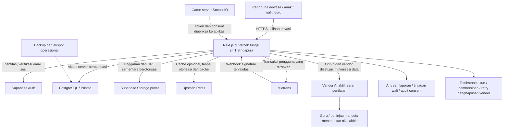

# Diagram sistem dan aliran data BahasaCerdas
Draf 3 Oktober 2026; cocokkan lokasi dan konfigurasi aktual sebelum isian OSS.

## Batas kepercayaan dan lokasi
Browser tidak menerima kredensial Prisma atau service-role. Migrasi membatasi akses SQL browser, dengan pengecualian notifikasi milik pengguna. Main Bersama memakai API aplikasi dan broadcast pemicu pemuatan ulang; akses data tetap diperiksa oleh server. Game server wajib memiliki origin dan tujuan aplikasi yang benar.

Region Vercel sin1 terlihat pada konfigurasi repo; ini tidak membuktikan lokasi semua layanan, log, CDN atau backup. Region Supabase, Upstash, game server, backup serta pemrosesan AI harus dilengkapi dari dashboard dan kontrak. Persetujuan pengguna tidak menggantikan analisis dasar transfer lintas negara.

Storage lama masih memiliki bucket publik pada audit metadata. Diagram privat menunjukkan sasaran setelah migrasi, bukan keadaan produksi saat ini. Inventaris referensi, perubahan URL, pencabutan objek asli dan cache, serta pengujian akses wajib diselesaikan sebelum melabeli migrasi selesai.

## Data dan tujuan
Akun/usia/wali: autentikasi dan perlindungan anak. Kelas/jawaban/progres: pembelajaran dan penilaian. Karya/rekaman: audiens yang diizinkan. Pembayaran: transaksi serta pembukuan minimum. Laporan/consent/audit: keselamatan, pembuktian dan hak data. AI: bantuan opsional dengan penilaian manusia. Analitik: opt-in dewasa, dimatikan untuk anak. Seluruh aliran mengikuti batas retensi, akses petugas, dan tinjauan vendor dalam register.
